# VolunteerHub Documentation

## Проект: VolunteerHub

## Съдържание

1. [Цел на системата](#1-цел-на-системата)
2. [Географски обхват](#2-географски-обхват)
3. [Потребителски роли](#3-потребителски-роли)
   - [Доброволец](#31-доброволец-обикновен-потребител)
   - [Организация](#32-организация)
4. [Модули на системата](#4-модули-на-системата)
   - [Аутентикация](#41-модул-аутентикация-authentication)
     - [Вход в системата](#411-екран-вход-в-системата-home-страница)
   - [Инициативи](#42-модул-инициативи)
     - [Всички инициативи](#421-екран-всички-инициативи)
     - [Детайли за инициатива](#422-екран-детайли-за-инициатива)
     - [Наши инициативи](#423-екран-наши-инициативи)
     - [Създай инициатива](#424-екран-създай-инициатива)
     - [Редактирай инициатива](#425-екран-редактирай-инициатива)
   - [Групи](#43-модул-групи)
     - [Групов фийд](#431-групов-фийд-стена)
     - [Групов чат](#432-групов-чат)
   - [Организации](#44-модул-организации)
   - [Профил на потребител](#45-модул-профил-на-потребител)
   - [Известия](#46-модул-известия-notifications)

---

> **Бележка:** Всички скрийншоти в тази документация са **илюстративни** и са създадени с помощта на **Bootstrap Studio**.

## 1. Цел на системата
**VolunteerHub** е платформа, която предоставя възможност на различни организации да публикуват доброволчески инициативи, а на потребителите (доброволци) – да ги преглеждат и да участват в тях.
Системата улеснява комуникацията между доброволци и организатори чрез специализирани групи за всяка инициатива, където се публикуват съобщения, информация за събитието и актуализации.

---

## 2. Географски обхват
VolunteerHub е предназначен за територията на **Република България**. Всички функционалности, полета за локация и валидации са съобразени с това ограничение.

### Обхватът включва:

- **Инициативи:** могат да се създават само с локация в България (град/населено място)
- **Списък с населени места:** dropdown менюта, които съдържат само български населени места
- **Регистрация на организации:** изисква:
  - български регистрационен номер (ЕИК/Булстат)
  - служебен имейл
  - адрес в България
- **Телефонни номера:** формат `+359XXXXXXXXX`
- **Интерфейс:** български
  - локализации на други езици не се предвиждат за първа версия

### Бележки за интеграция по модули:

- **Authentication/Registration (Organizations)**
  - Валидация на ЕИК/Булстат
  - Валидация на адрес
  - Валидация на телефонен номер

- **Initiatives/Create Initiative**
  - Избор на населено място само в рамките на България

- **Initiatives/List & Filters**
  - Филтри по локация показват само български населени места

---

## 3. Потребителски роли

### 3.1 Доброволец (обикновен потребител)

**Описание на ролята:**  
Доброволецът е обикновен потребител, който разглежда инициативи и може да участва в тях. Той няма административни права.

**Основни възможности на доброволеца:**

1. **Преглеждане на инициативи**  
   - Доброволецът може да вижда списък с всички активни инициативи, публикувани от различни организации.

2. **Филтриране на инициативи**  
   - Статус (Предстояща, В процес, Минали - не се показват)  
   - Дата от
   - Дата до  
   - Категория (екология, социални дейности, образование и др.)  
   - Етикети  
   - Град

3. **Преглед на детайлите на инициатива**  
   - Описание (подробно описание)  
   - Дата от
   - Дата до  
   - Час  
   - Град
   - Местоположение  
   - Участници  
   - Категория  
   - Контакт за връзка  
   - Етикети  
   - Прикачени файлове

4. **Записване за инициатива**  
   - Чрез бутон „Запиши се“ потребителят потвърждава участие.

**След записване:**  
- Доброволецът автоматично се добавя към групата на инициативата.  
- Като част от групата може да:  
  - Получава известия за нова активност  
  - Публикува публикации след одобрение от администратор/модератор
  - Преглежда публикации от администратори/модератори  
  - Участва в групов чат

**Какво НЕ може да прави:**  
- Не може да редактира чужди публикации (освен собствените си)  
- Не може да трие чужди публикации (освен собствените си)  
- Не може да трие инициативата

---

### 3.2 Организация

**Описание на ролята:**  
Организацията е юридическо лице или организаторска група, която може да създава и управлява инициативи. След регистрация организацията може да има множество членове, разделени на роли.

**Роли в рамките на организацията:**

#### Администратор
- Създава инициативата (групата се създава автоматично с нея)  
- Пълни права:  
  - Публикуване и редакция на постове  
  - Изтриване на постове  
  - Управление на доброволците, записани за инициативата  
  - Изтриване на инициативата
  - Промяна на ролите на членовете на организацията (напр. модератор → администратор)

#### Модератор
- Поддържа активността в групата  
- Може да:  
  - Публикува постове  
  - Редактира публикации, които е публикувал  
  - Следи и изтрива неподходящо съдържание 
- Не може да променя роли на други потребители  
- Не може да изтрива инициативата

#### Член
- Може да публикува и изтрива собствени постове в инициативата  
- Може да харесва и коментира публикации  
- Може да участва в груповия чат  
- Не може да редактира или изтрива чужди публикации  
- Не може да променя роли на други потребители  
- Не може да изтрива инициативата

**Специален случай: потребител с повече от една роля**  
- Един потребител може да притежава повече от една роля (напр. доброволец и член на организация)  
- Активната роля зависи от начина на влизане в системата (напр. дали сме дали отметка „Влизам като организация“ при формата за влизане)

**Ограничение:**  
- Потребител, който е член на дадена организация, **не може** да се записва като доброволец за инициативи, създадени от същата организация  
- Може да се записва като доброволец само за инициативи, създадени от други организации

---

## 4. Модули на системата

Платформата VolunteerHub се състои от няколко основни модула, всеки от които отговаря за конкретна част от функционалността. Всеки модул включва един или няколко екрана (страници).

---

## 4.1 Модул: Аутентикация (Authentication)

### 4.1.1 Екран: Вход в системата (Home страница)

Началната страница съдържа форма за аутентикация, организирана в три таба:
- **Вход**
- **Регистрация (Доброволец)**
- **Регистрация (Организация)**

**Навигация:**  
На Home страницата няма допълнителна навигация. Потребителят може да премине само към:
- Таб Вход / Регистрация
- „Забравена парола“ (от таб Вход)

---

### Таб: Регистрация (Доброволец)
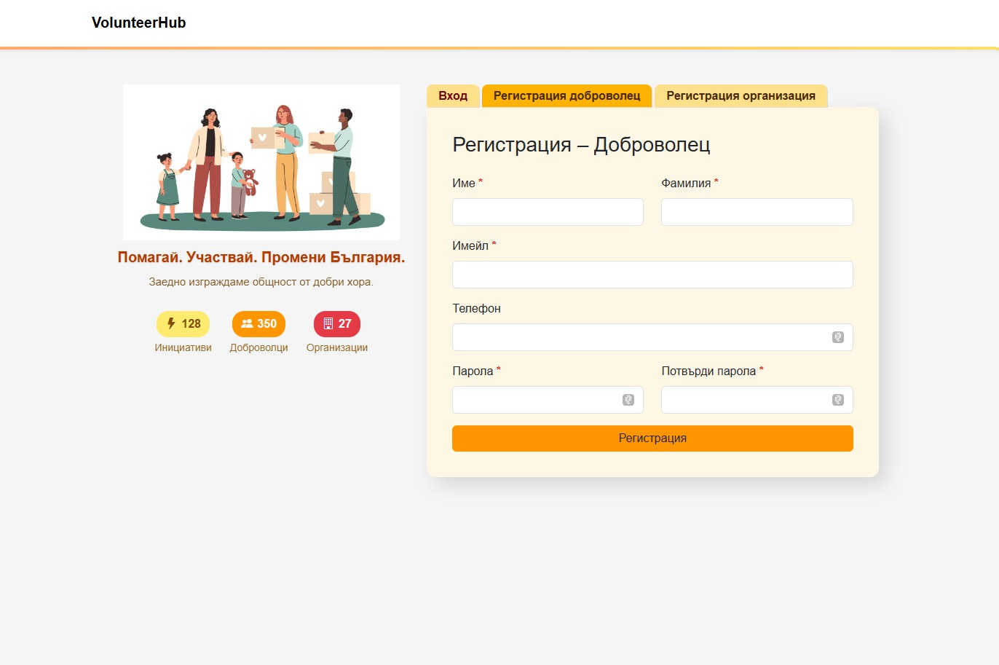
Полета:
- Име*
- Фамилия*
- Имейл*
- Телефон
- Парола*
- Потвърждение на парола*

---

### Таб: Регистрация (Организация)
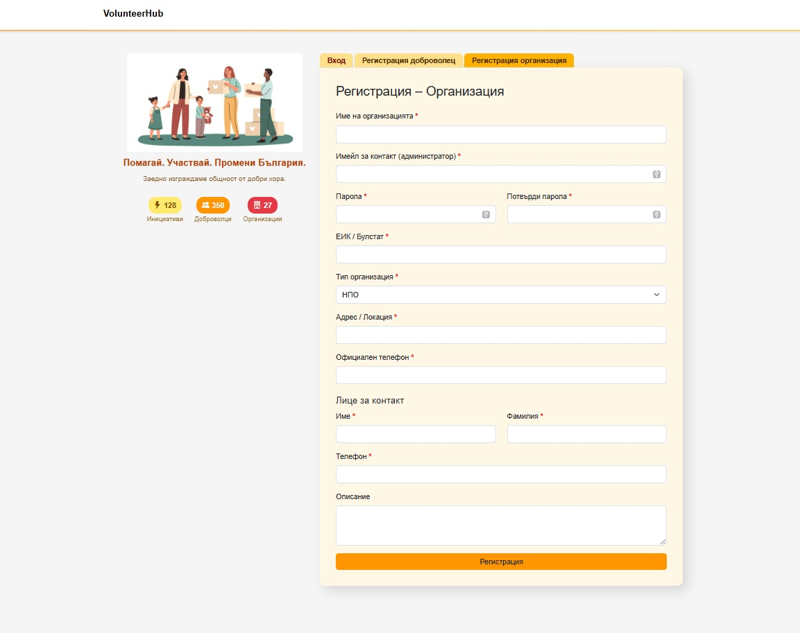
Регистрацията на организация изисква повече данни, тъй като тя функционира като „бизнес профил“.

**Задължителни данни:**
- Име на организацията*
- Имейл за контакт*
- Парола* + потвърждение*
- ЕИК* / Булстат
- Тип организация*:
  - НПО
  - Училище
  - Частна компания
  - Общинска структура
  - Друго
- Локация / Адрес*
- Официален телефон за контакт*

**Лице за контакт (администратор):**
- Име*
- Фамилия*
- Телефон*

**Допълнителни полета:**
- Кратко описание на организацията (mission/vision)

**Допълнителни полета, достъпни в настройките на организацията:**
- Уебсайт
- Лого (upload)
- Социални мрежи

**Специални сценарии:**
- При регистрация на организация системата проверява дали имейлът на лицето за контакт вече съществува като потребител.
- Ако имейлът съществува:
  - към съществуващия потребител се добавя роля **Администратор** за новата организация.
- Ако имейлът не съществува:
  - системата автоматично създава нов потребителски профил;
  - профилът получава:
    - базова роля **Доброволец**;
    - роля **Администратор** за регистрираната организация.
- Така всяка организация винаги има поне един администратор.

---

### Таб: Вход
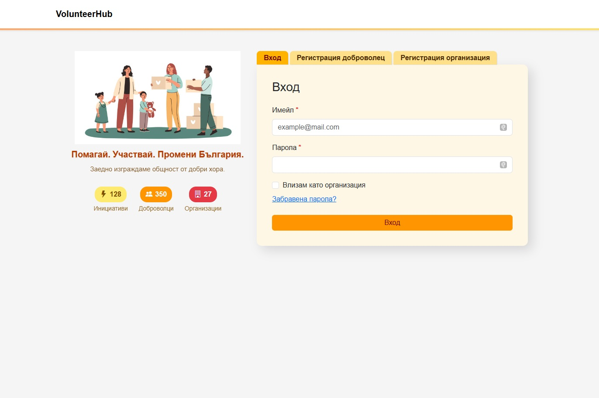
Потребителят може да влезе като:
- Доброволец
- Организация

Използва се чекбокс:  
☐ „Влизам като организация“

Когато е маркиран, системата извършва проверка в таблицата за организации и роли на потребителите.

**Полета за вход:**
- Имейл*
- Парола*

**Допълнителни функции:**
- „Забравена парола“ → изпращане на имейл за възстановяване
- Покажи / скрий парола

**Специални сценарии:**
- Доброволец може да бъде добавен към организация чрез имейл и да получи нова роля
- Доброволец може да създаде собствена организация и да получи роля администратор
- Член/модератор/администратор може да влиза като доброволец, без отметката „Влизам като организация“

---

## 4.2 Модул: Инициативи

Модулът позволява:
- На доброволците – да разглеждат и участват в инициативи
- На организациите – да създават, редактират и управляват инициативи

### Навигация

**Доброволец:**
- Инициативи
  - Мои инициативи
  - Всички инициативи

**Организация:**
- Инициативи
  - Наши инициативи
  - Създай инициатива

---

### 4.2.1 Екран: Всички инициативи
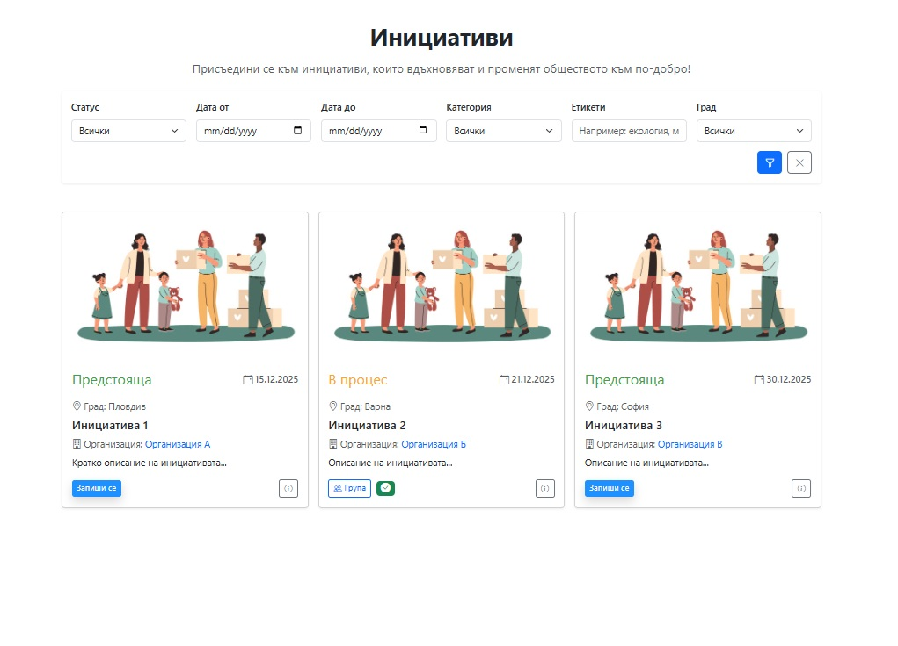

Достъпно за: доброволци и организации

**Функционалност:**
- Списък с всички активни инициативи
- Филтри: Статус, Дата от, Дата до, Категория, Етикети, Град
- Бутон „Виж детайли“

---

### 4.2.2 Модален прозорец: Детайли за инициатива
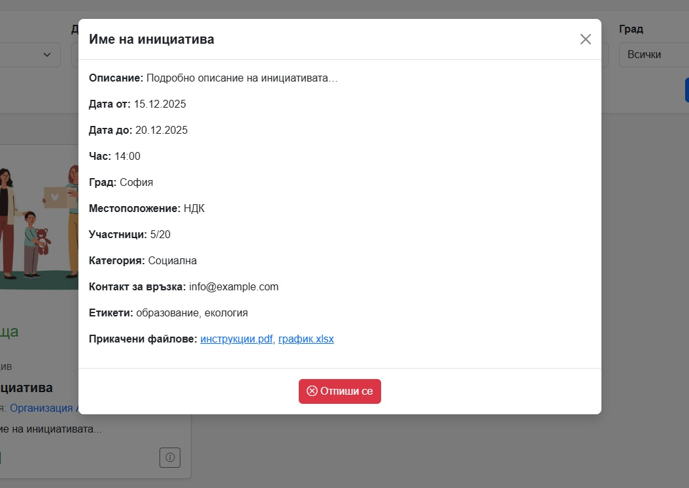
Показва:
- Заглавие, описание
- Дата от
- Дата до
- Час
- Град
- Местоположение
- Участници
- Категория
- Контакт за връзка
- Етикети
- Прикачени файлове

**Действия според роля:**

- **Доброволец**
  - Бутон „Запиши се“
  - При записване: бутон „Група“ + индикатор „Записан“

- **Организация**
  - Само преглед
  - Управление се извършва от „Наши инициативи“

---

### 4.2.3 Екран: Наши инициативи
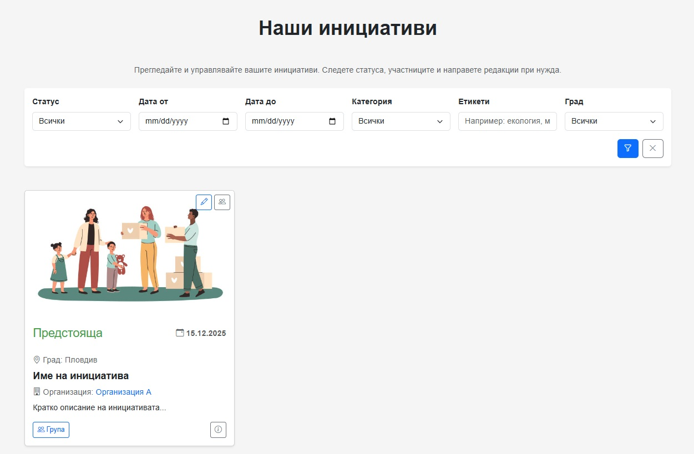
Достъпно за: организации

Съдържа:
- Статус
- Дата от
- Град
- Име
- Кратко описание

**Бутони върху всяка инициатива:**

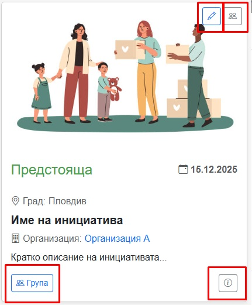

- Група
- Детайли (при натискане се показва модал с повече информация и възможност за отмяна на инициативата ако ролята на логнатия потребител е администратор)

- [Редактирай](#425-екран-редактирай-инициатива) (води към екран за редактиране на инициатива)
- Участници (при натискане се показва модал, който показва участниците, които са се записали)
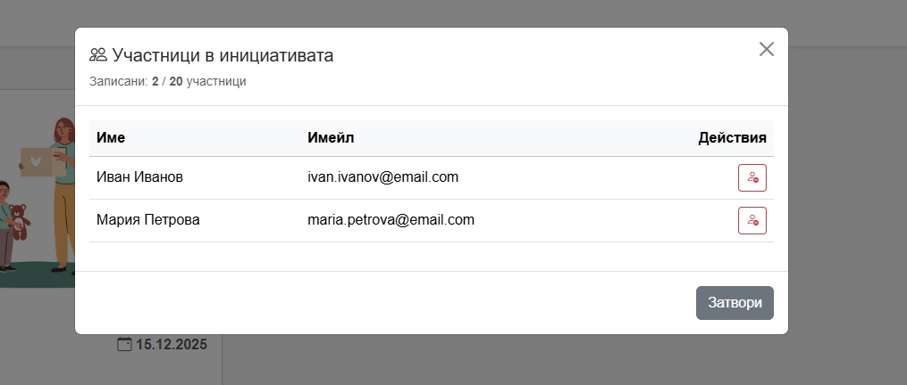

---

### 4.2.4 Екран: Създай инициатива
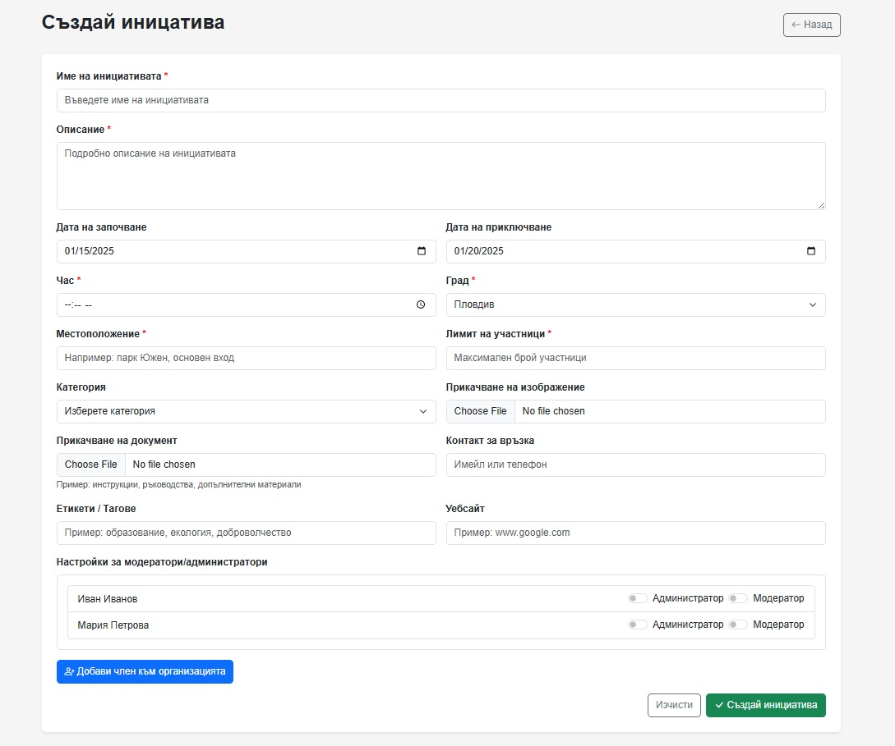

**Полета:**
- Заглавие
- Описание
- Дата от
- Дата до
- Час
- Град
- Местоположение
- Категория
- Етикети
- Максимален брой участници (по избор)
- Контакт за връзка
- Прикачени файлове
- Настройки за модератори/админи - с възможност да се добавят ако ролята на логнатия потребител е администратор

**Бутони:**
- Създай инициатива
- Изчисти
- Назад

**Валидации:**
- Задължителни полета
- Дата до ≥ дата от

---

### 4.2.5 Екран: Редактирай инициатива
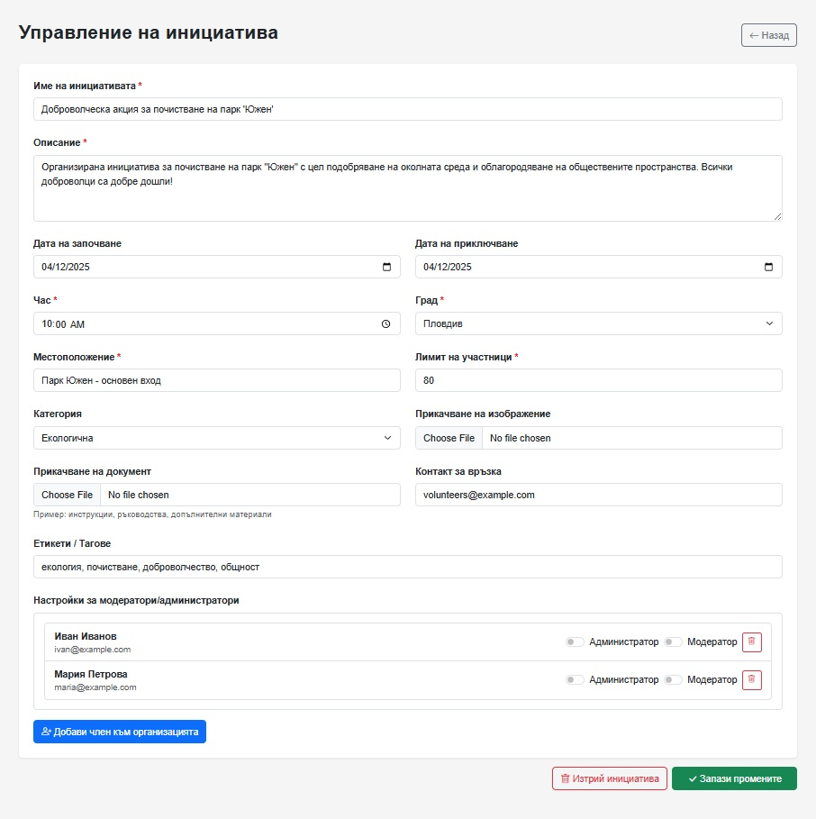

Достъпно за: организации (само собствени инициативи)

**Бутони:**
- Запази промените
- Изтрий инициатива (само администратор)
- Назад

При изтриване групата се архивира и остава достъпна само за четене.

---

## 4.3 Модул: Групи

Групите са основното място за комуникация. При създаване на инициатива автоматично се създава и прилежаща към нея група.

### Права по роли:
- **Администратор:** пълни права
- **Модератор:** ограничени административни права
- **Доброволец:** публикува след одобрение

---

### 4.3.1 Групов фийд (Стена)
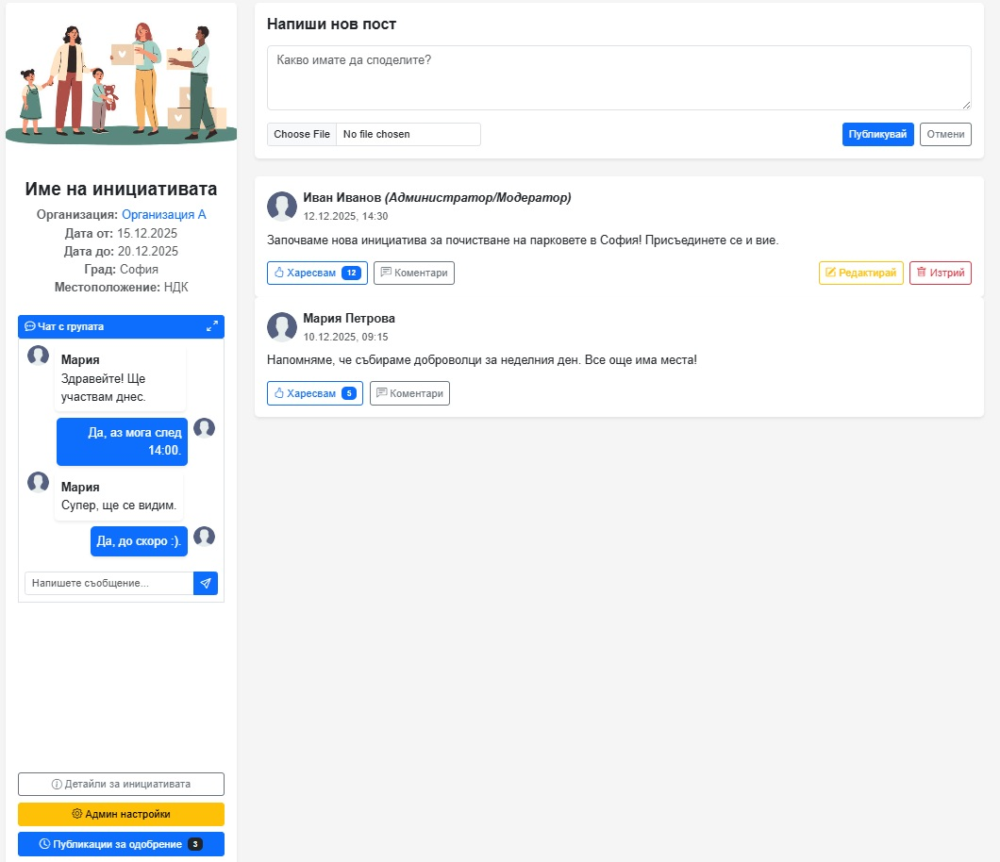

Съдържа:
- Публикации
- Коментари
- Харесвания
- Прикачени файлове

---

### 4.3.2 Групов чат

Груповият чат осигурява бърза и директна комуникация между всички членове на дадена инициатива. Може да се достъпи през Sidebar на групата в малък вариант.
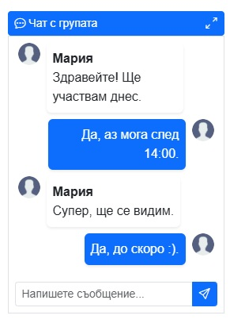

Има възможност за уголемяване чрез появата на модален прозорец.
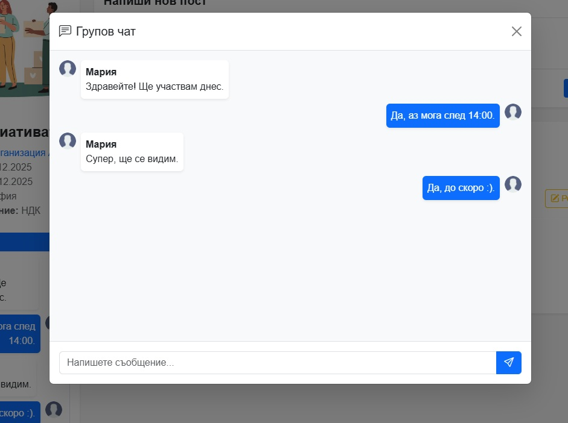

#### Функционалности
- Изпращане и получаване на текстови съобщения между всички участници в групата
- Визуализиране на информация за изпращача към всяко съобщение:
  - име на потребителя
  - роля в рамките на инициативата (администратор/модератор/доброволец)
- Показване на системни съобщения, автоматично генерирани от системата

#### Системни съобщения – примери
- „Ива Стоянова се присъедини към групата“
- „Петър Иванов напусна инициативата“
- „Инициативата беше архивирана“

#### Права за достъп
- Администратор:
  - може да чете и изпраща съобщения в чата
- Модератор:
  - може да чете и изпраща съобщения в чата
- Член:
  - може да чете и изпраща съобщения в чата
- Доброволец:
  - може да чете и изпраща съобщения в чата

#### Забележки
- Ролята, която се визуализира към съобщението, е ролята на потребителя в рамките на конкретната инициатива
- В първа версия не се поддържат:
  - редакция на чат съобщения
  - изтриване на чат съобщения
  - прикачване на файлове в чата
---

## 4.4 Модул: Организации
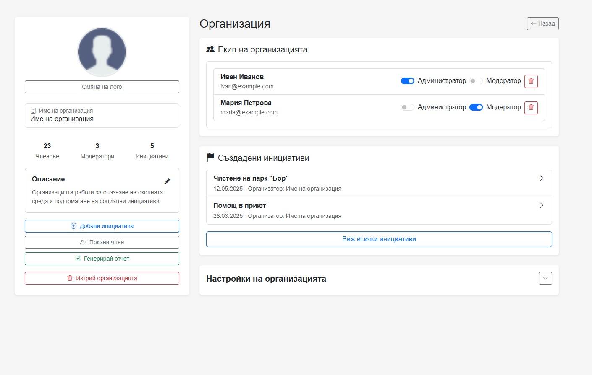

### Екран: Профил на организация

Задължително трябва да съдържа информация за:
- Името на организацията
- Лого
- Описание
- Активни инициативи
- Екип

**Бутони:**
- [Добави инициатива](#424-екран-създай-инициатива)
- Покани член (отваря се модален прозорец, в който въвеждаме имейл на новия член, който искаме да добавим - трябва да имаме администраторска роля)
- Генерирай отчет (справка за участници и активност на инициативите)
- Изтрий организация (само за администраторска роля)

---

## 4.5 Модул: Профил на потребител
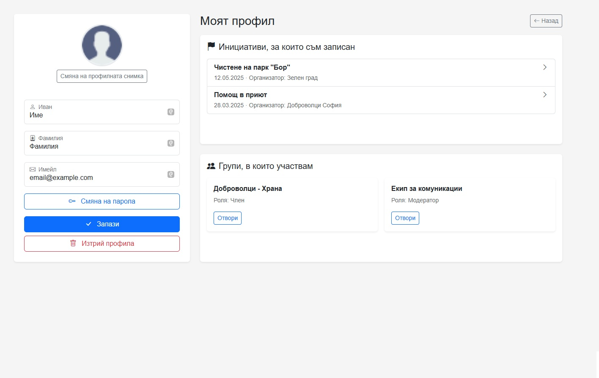

### Екран: Моят профил

- Име
- Имейл
- Смяна на парола
- Записани инициативи
- Групи

---

## 4.6 Модул: Известия (Notifications)
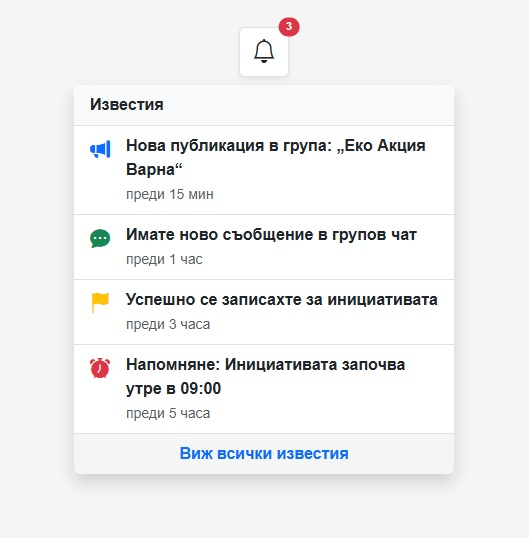

### Камбанка
- Badge с брой непрочетени известия
- Dropdown с последните известия

### Примери:
- „Нова публикация в група“
- „Ново съобщение в чат“
- „Успешно записване за инициатива“
- „Напомняне за предстояща инициатива“

---

